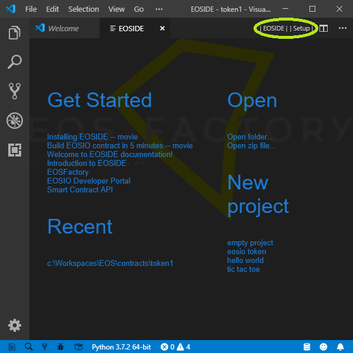
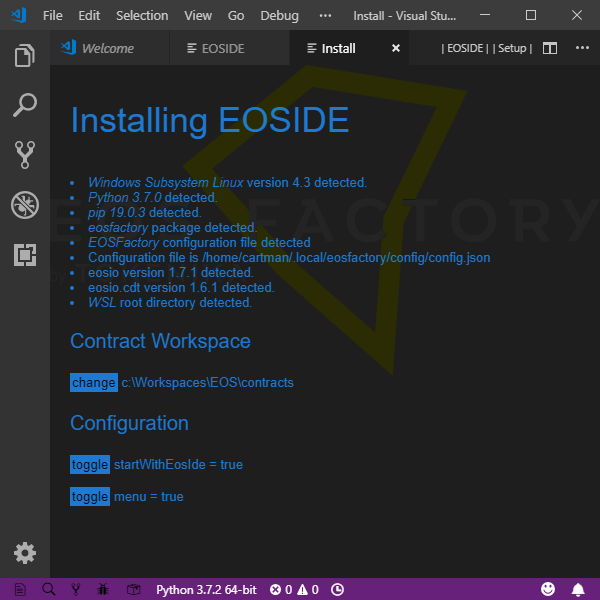

# EOSIDE - an Integrated Development Environment for EOSIO smart-contracts

With [EOSIO](https://github.com/eosio) installed on your system, EOSIDE organizes the workflow of development process for EOSIO smart-contracts.

This process is composed of the following elements:

* project standardization,
* easy access to project archive,
* referencing documentation and tutorials,
* automatic availability of standard libraries,
* dependency management,
* [IntelliSense](https://code.visualstudio.com/docs/editor/intellisense) code completion,
* compilation and building,
* testing,
* deployment.

EOSIDE is an extension of [Visual Studio Code](https://code.visualstudio.com/) (VSC).

Watch a short [video]("https://eosfactory.io/eoside/html/_static/five_minutes.mp4) showing EOSIDE in action.

And here is another [video](https://eosfactory.io/eoside/html/_static/installing.mp4) demonstrating the setup process and a *Hello World*  test.

## Preview of the application

The user interface of EOSIDE is composed of two views.

The standard view, called `EOSIDE`, is displayed when VSC is started empty, i.e. with the `code -n ""` command.



Let's go through its options:

* *Get Started* contains links to tutorials and other documentation.
* *New project* lets you create a new project from a template.
* *Recent* lists existing projects.
* *Open* triggers specific actions.
* And the two menu buttons located in the title bar, namely `EOSIDE` and `Setup`, display corresponding views.


The other view is called `Setup` and is available when a project is already opened. This view allows you to configure the current project.


Let's go through its options:

* *Include* lists directories containing headers involved in the project. This list is extracted from the content of the `.vscode/c_cpp_properties.json` file generated by `ms-vscode.cpptools`. The entries are provided with buttons for editing the list. Also, new items can be added. Note: on Windows and WSL Ubuntu, all file paths are expressed relative to the `WSL root`.

* *Libs* lists libraries resolving outer dependencies of the project.

* *Compiler Options* lists parameters of the WASM compiler.

* *Contract Account* defines the account that holds the contract. Its name has to be chosen from a list given with the bash command:

    ```bash
    python3 -m eosfactory.testnets
    ```

* The buttons in the top, labelled `Compile`, `Build`, `EOSIDE` and `Bash`, trigger corresponding actions. Especially, the `Bash` button, available on Windows only, starts a new bash terminal. All these actions can be invoked with keyboard shortcuts or with extension commands.

All the dependencies are stored in the `.vscode/c_cpp_properties.json` file. This file feeds both the compile procedures, build procedures and the *IntelliSense* features of VSC.

## Installation

EOSIDE requires a prior installation of [EOSIO](https://github.com/eosio) on your system.



