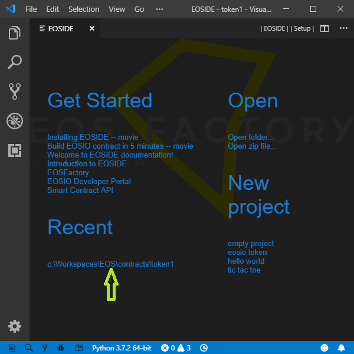

# *EOSIde* -- Integrated Development Environment for EOSIO smart contracts

*EOSIde* organizes the workflow of development process for EOSIO smart contracts -- if such a process can be seen as composed of the following elements:

* project standardization,
* easy access to an project archive,
* referencing documentation and tutorials,
* automatic availability of standard libraries,
* dependency management,
* compilation and building,
* debugging and testing,
* deployment.

*EOSIde* is an extension to the [Visual Studio Code](https://code.visualstudio.com/).

## Get Started view

If the EOSIde extension is installed -- with the default configuration -- on the VSCode, and if VSCode is started empty with the command `code -n ""`, it opens the *Get Started*, view as shown in the picture below:


Let us list the functions of this view, 

* **Get Started** entries link to tutorials and other documentation.
* **New project** entries trigger creation of a project based on a template.
* **Recent** entries switch to projects started with the *New project* triggers.
* **Open** entries trigger specific actions.
* Two menu buttons in the editor title bar, namely `|EOS IDE|` and `|Setup|` display corresponding views.

## Project standardization

Any EOSIO smart contract resides in its folder. 
EOSIde supports a specific layout of the contract folder:
* **root** -- project folder,
    * **.vscode** -- system folder
    * **build** -- folder where contract WASM and ABI files go,
    * **resources** -- folder containing Ricardian contract files and whatever else,
    * **src** -- folder with CPP/C source files
    * **tests** - folder with Python scripts, especially EOSFactory scripts
    * **CMakeLists.txt*  - the CMake lists file of the project

In the picture below, it is shown an exemplary project layout.


EOSIde can produce a new project. A project may be empty, or it can be based on a template. The following figure show the selection process. First, the *EOS IDE* screen has to be active. Next, click the chosen template.


A native folder chooser opens. Create a folder named as the new project. Select the new folder, click the *Open* button. The project folder is in the *EXPLORER* panel, now. The path to the project is in the *Recent* list, which is active one: you can open any of the listed projects just clicking its entry.



## Dependency management

Dependency management is implemented with the view shown in the following picture.


* *Include* lists directories containg headers needed by the project. This list is linked to the file *.vscode/c_cpp_properties.json*. The entries are provided with buttons that manipulate them, especially, new items may be added with the system-native file dialog. With *Windows*, all file paths are expressed relative to the *WSL root* (Windows Subsystem Linux).
* *Libs* lists libraries resolving outer dependencies of the project.
* *Compiler Options* lists parameters of the wasm compiler.
* The buttons in the top, labelled *Compile*, *Build*, *EOS IDE* and *bash*, trigger corresponding actions. Especially, the *bash* button -- present if *Windows* -- starts a new *bash* terminal.

## Compile and build

Compiling does not produce contract files, its purpose is to check whether the source code of the contract is compilable, and if not, to see the error log.

Building results in ABI and WASM files.

Compilation depends on project dependencies like included headers and linked libraries. The dependencies registered to the project, as it is [explained](#Dependency-management), are automatically involved into the presented compilation methods.

### VSCode style: compile and build with VSCode tasks and commands

Compile:
* **vscode task:** Terminal => Run Task... => Compile
* **vscode command:** ctrl+shift+p => eosid compile
* **keybord shortcut:** ctrl+shift+c

Build:
* **vscode task:** Terminal => Run Build Task...
* **vscode command:** ctrl+shift+p => eosid build
* **keybord shortcut:** ctrl+shift+b

In the picture below, it is shown the task selection dialog:


### Build using CMake

If your computer system is Windows, the default terminal of the VSCode is Powershell, while the CMake operations have to be executed with Ubuntu bash, therefore use ctrl+shift+t shortcut to a vscode command that opens a new Ubuntu bash terminal. Or issue the command `bash` in the Powershell terminal.

In the Ubuntu bash terminal, do...

```bash
cd build
cmake ..
make
```

...you can expect a response like the following:

```bash
cartman@cartman-PC:/mnt/c/Workspaces/EOS/contracts/token$ cd buildcartman@cartman-PC:/mnt/c/Workspaces/EOS/contracts/token/build$ cmake ..
-- Configuring done
-- Generating done
-- Build files have been written to: /mnt/c/Workspaces/EOS/contracts/token/build
cartman@cartman-PC:/mnt/c/Workspaces/EOS/contracts/token/build$ make
Scanning dependencies of target abi
ABI file writen to file:
    /mnt/c/Workspaces/EOS/contracts/token/build/token.abi
Built target abi
Scanning dependencies of target wast
WASM file writen to file:
    /mnt/c/Workspaces/EOS/contracts/token/build/token.wasm
Built target wast
cartman@cartman-PC:/mnt/c/Workspaces/EOS/contracts/token/build$
```

## Build with EOSFactory

If your computer system is Windows, see [note](#Compile-and-build-using-CMake).

You can build a contract programmatically in a Python module. Here we present the idea with an interactive session. Start the session and, then, use EOSFactory:

```bash
python3
```

```python
from eosfactory.eosf import ContractBuilder
ContractBuilder().build()
```

Here is an exemplary listing of the bash action:

```bash
Python 3.5.2 (default, Nov 23 2017, 16:37:01)
[GCC 5.4.0 20160609] on linux
Type "help", "copyright", "credits" or "license" for more information.
>>> from eosfactory.eosf import ContractBuilder
>>> ContractBuilder().build()
ABI file writen to file:
    /mnt/c/Workspaces/EOS/contracts/token/build/token.abi
WASM file writen to file:
    /mnt/c/Workspaces/EOS/contracts/token/build/token.wasm
```

## Installation

EOSIde needs [*EOSIO*](https://github.com/eosio) to be installed in the system. Also, it needs *python3* (Ubuntu, even if the system is Windows with WSL Ubuntu).

