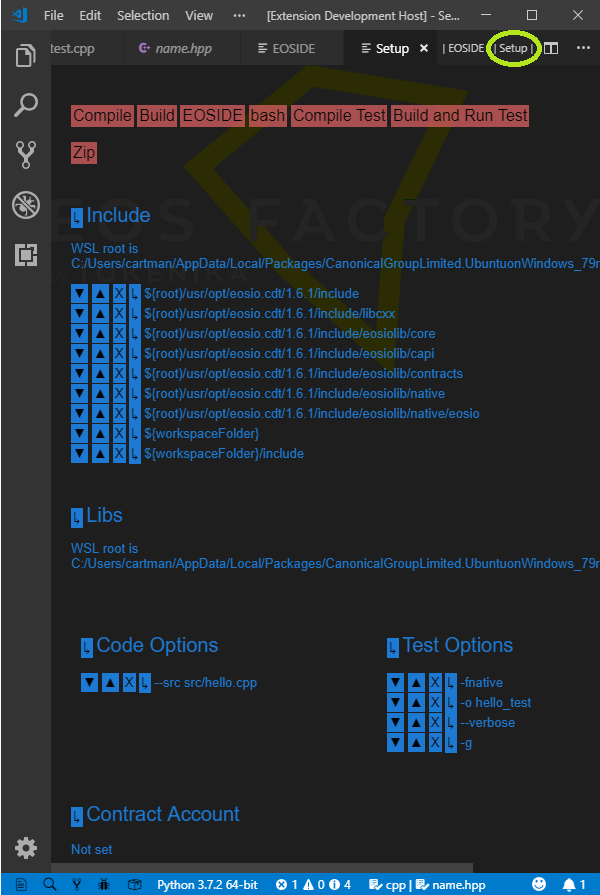

# *EOSIde* -- Integrated Development Environment for EOSIO smart contracts

*EOSIde* organizes the workflow of development process for EOSIO smart contracts -- if such a process can be seen as composed of the following elements:

* project standardization and bookkeeping,
* referencing documentation and tutorials,
* automatic availability of standard libraries,
* dependency management,
* compilation and build,
* debugging and testing,
* deployment.

*EOSIde* is an extension to the [Visual Studio Code](https://code.visualstudio.com/).

## Get Started view

If the EOSIde extension is installed -- with the default configuration -- on the VSCode, and if VSCode is started empty with the command `code -n ""`, it opens the *Get Started*, view as shown in the picture below:

Let us list the functions of this view, 

* *Get Started* entries link to tutorials and other documentation.
* *New project* entries trigger creation of template projects.
* *Recent* entries switch to projects started with the *New project* triggers.
* *Open* entries trigger specific actions.
* Two menu buttons in the editor title bar, namely `|EOS IDE|` and `|Setup|` display corresponding views.

## Project standardization and bookkeeping

Any EOSIO smart contract resides in its folder. 
EOSIde supports a specific layout of the contract folder:
* **root** -- project folder,
    * **.vscode** -- system folder
    * **build** -- folder where contract WASM and ABI files go,
    * **resources** -- folder containing Ricardian contract files and whatever else,
    * **src** -- folder with CPP/C source files
    * **tests** - folder with Python scripts, especially EOSFactory scripts
    * **CMakeLists.txt*  - the CMake lists file of the project

In the picture below, it is shown an exemplary project layout.

EOSIde can produce a new project. A project may be empty, or it can be based on a template. The following figure show the selection process. First, the *EOS IDE* screen has to be active. Next, click the chosen template.

A native folder chooser opens. Create a folder named as the new project. Select the new folder, click the *Open* button. The project folder is in the *EXPLORER* panel, now. The path to the project is in the *Recent* list, which is active one: you can open any of the listed projects just clicking its entry.

## Referencing documentation and tutorials

## Preview of the application

Another view is about the setup of the current EOSIO smart contract project. It is shown in the picture below.

* *Include* lists directories contain headers involved in the project. This list copies the corresponding one in the `.vscode/c_cpp_properties.json` file that comes from *ms-vscode.cpptools*. The entries are provided with buttons that can manipulate them, especially, new items can be added with a system-native file dialog. With *Windows* and WSL Ubuntu, all file paths are expressed relative to the `WSL root`.
* *Libs* lists libraries resolving outer dependencies of the project.
* *Compiler Options* lists parameters of the wasm compiler.
* The buttons in the top, labelled *Compile*, *Build*, *EOS IDE* and *bash*, trigger corresponding actions. Especially, the *bash* button -- present if *Windows* -- starts a new *bash* terminal. All this actions can be invoked with keyboard shortcuts or with extension commands.

## Installation

EOSIde needs [*EOSIO*](https://github.com/eosio) to be installed in the system. Also, it needs *python3* (Ubuntu, even if the system is Windows with WSL Ubuntu).

