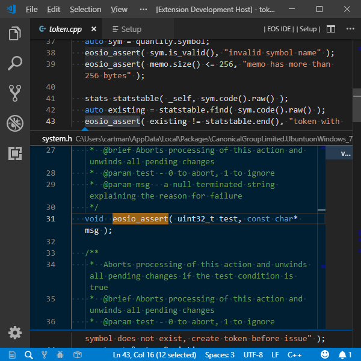
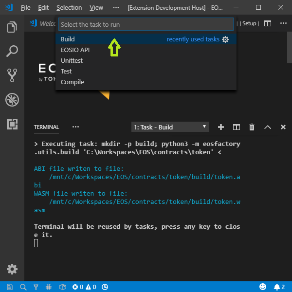

# EOSIDE - an Integrated Development Environment for EOSIO smart-contracts

With [EOSIO](https://github.com/eosio) installed on your system, EOSIDE organizes the workflow of development process for EOSIO smart-contracts.

This process is composed of the following elements:

- project standardization,
- easy access to project archive,
- referencing documentation and tutorials,
- automatic availability of standard libraries,
- dependency management,
- [IntelliSense](https://code.visualstudio.com/docs/editor/intellisense) code completion,
- compilation and building,
- testing,
- deployment.

EOSIDE is an extension of [Visual Studio Code](https://code.visualstudio.com/) (VSC).

Watch a short [video](https://eosfactory.io/eoside/html/_static/five_minutes.mp4) showing EOSIDE in action. And here is another [video](https://eosfactory.io/eoside/html/_static/installing.mp4) demonstrating the setup process and a *Hello World*  test.

## Get Started view

The standard view, called `EOSIDE`, is displayed when VSC is started empty, i.e. with the `code -n ""` command.


Let's go through its options:

- *Get Started* contains links to tutorials and other documentation.
- *New project* lets you create a new project from a template.
- *Recent* lists existing projects.
- *Open* triggers specific actions.
- And the two menu buttons located in the title bar, namely `EOSIDE` and `Setup`, display corresponding views.

## Project standardization

EOSIDE supports a specific layout of the contract folder:
* **root** -- project folder,
    * **.vscode** -- system folder
    * **build** -- folder where contract WASM and ABI files go,
    * **recardian** -- folder containing Ricardian contract files etc.,
    * **src** -- folder containing source files
    * **include** -- folder containing header files
    * **tests** - folder containing Python scripts, especially EOSFactory scripts
    * `CMakeLists.txt`  - the CMake lists file of the project

An exemplary project layout is demonstrated in the picture below:


EOSIDE offers the option o create a new project. A project may be empty, or it can be based on a template. The following figure show the selection process. First, the `EOSIDE` screen has to be active. Next, select the template by clicking it.


A folder chooser opens. Create a folder named after the new project. Select the new folder, click the `Open` button. The project folder is in the `EXPLORER` panel, now. The path to the project is added to the *Recent* list, which becomes active and allows you to open any of the listed projects by clicking their paths.


## Dependency management

Dependency management is implemented with the `Setup` view shown in the following picture.


Let's go through its options:

- *Include* lists directories containing headers involved in the project. This list is extracted from the content of the `.vscode/c_cpp_properties.json` file generated by `ms-vscode.cpptools`. The entries are provided with buttons for editing the list. Also, new items can be added. Note: the left mouse button opens native dialog, the right one opens VSCode input box. Note: on Windows and WSL Ubuntu, all file paths are expressed relative to the `WSL root`.

- *Libs* lists libraries resolving outer dependencies of the project.

- *Compiler Options* lists parameters of the WASM compiler.

- *Contract Account* defines the account that holds the contract. Its name has to be chosen from a list given with the bash command:

  ```bash
  python3 -m eosfactory.testnets
  ```

- The buttons in the top, labelled `Compile`, `Build`, `EOSIDE` and `Bash`, trigger corresponding actions. Especially, the `Bash` button, available on Windows only, starts a new bash terminal. All these actions can be invoked with keyboard shortcuts or with extension commands.

All the dependencies are stored in the `.vscode/c_cpp_properties.json` file. This file feeds both the compile procedures, build procedures and the *IntelliSense* features of VSC.

## IntelliSense

VSC has the *IntelliSense* code completion functionality built-in, but it only works if proper metadata is provided. EOSIDE supplies this metadata for EOS smart-contracts automatically.

As an example, the following picture shows the result of the `Pick Definition` command applied to the `check` function.



## Compile and build

The compilation process does not generate any output files. Its purpose is to verify that the source code of the contract can be built, and if not, to produce an error log.

Whereas, the building process results in generating ABI and WASM files.

The compilation process requires that project dependencies are satisfied, such as included headers and linked libraries. The dependencies registered for the project, as explained [here](#Dependency-management), are automatically applied.

### VSC style: compile and build with VSC tasks and commands

To compile:
* **vsc task:** `Terminal` > `Run Task...` > `Compile`
* **vsc command:** `ctrl+shift+p` > `eosid compile`
* **keyboard shortcut:** `ctrl+shift+c`

To build:
* **vsc task:** `Terminal` > `Run Build Task...`
* **vsc command:** `ctrl+shift+p` > `eosid build`
* **keyboard shortcut:** `ctrl+shift+b`

The picture below shows how you can access tasks in VSC:



### Build using CMake

If you are on Windows, the default terminal of the VSC is PowerShell, while the CMake operations have to be executed with Ubuntu bash. To open a new Ubuntu bash terminal use the `ctrl+shift+t` shortcut in VSC. Alternatively, issue the `bash` command in the PowerShell terminal.

In the Ubuntu bash terminal, type these commands:

```bash
cd build
cmake ..
make
```

As a result, you should get a response similar to this:

```bash
cartman@cartman-PC:/mnt/c/Workspaces/EOS/contracts/token$ cd buildcartman@cartman-PC:/mnt/c/Workspaces/EOS/contracts/token/build$ cmake ..
-- Configuring done
-- Generating done
-- Build files have been written to: /mnt/c/Workspaces/EOS/contracts/token/build
cartman@cartman-PC:/mnt/c/Workspaces/EOS/contracts/token/build$ make
Scanning dependencies of target abi
ABI file written to file:
    /mnt/c/Workspaces/EOS/contracts/token/build/token.abi
Built target abi
Scanning dependencies of target wast
WASM file writen to file:
    /mnt/c/Workspaces/EOS/contracts/token/build/token.wasm
Built target wast
cartman@cartman-PC:/mnt/c/Workspaces/EOS/contracts/token/build$
```

### Build with EOSFactory

You can build a smart-contract programmatically using Python.

Switch to Python console:

```bash
python3
```

Once the Python prompt appears, continue with these commands:

```python
from eosfactory.eosf import ContractBuilder
ContractBuilder().build()
```

This is the expected result:

```bash
Python 3.5.2 (default, Nov 23 2017, 16:37:01)
[GCC 5.4.0 20160609] on linux
Type "help", "copyright", "credits" or "license" for more information.
>>> from eosfactory.eosf import ContractBuilder
>>> ContractBuilder().build()
ABI file writen to file:
    /mnt/c/Workspaces/EOS/contracts/token/build/token.abi
WASM file writen to file:
    /mnt/c/Workspaces/EOS/contracts/token/build/token.wasm
```

## Deploy contract

Deployment means attaching a smart-contract to an EOS account. A default account can be defined with the [*Setup*](#Dependency-management) view.

The following three subsections show how to deploy the contract of the current project to the default account.

### Deploy with VSC command

* **vsc command:** `ctrl+shift+p` > `eosid deploy`
* **keyboard shortcut:** `ctrl+shift+y`

### Deploy with Ubuntu bash

```bash
python3 -m eosfactory.deploy
```

### Deploy with EOSFactory

```python
import eosfactory.core.logger as logger
from eosfactory.shell.contract import Contract
from eosfactory.core.teos import get_c_cpp_properties

c_cpp_properties = teos.get_c_cpp_properties()
if not c_cpp_properties:
    logger.ERROR('''
    The testnet account is not set and it can not be found any 
    c_cpp_properties json file.
        ''')

if not "contractAccount" in c_cpp_properties:
    logger.ERROR('''
    The testnet account is not set, and it can not be found in a 
    c_cpp_properties json file.
        ''')

testnet_account = eosfactory.core.testnet.get_testnet(testnet_account_name)

if not testnet_account:
    logger.ERROR('''
    There is not any testnet account named '{}' in the list. 
    Use the bash command 
    `python3 -m eosfactory.utils.register_testnet -h`
    to get instructions how to register a testnet account.
    '''.format(testnet_account_name))

testnet_account.configure()
testnet_account.verify_production()
contract_account = account.restore_account(
                                        testnet_account_name, testnet_account)
Contract(contract_account).deploy()
```

## Testing

Tests are Python scripts located in the `tests` directory. Any test script can be executed in a bash terminal, for example:

```bash
python3 tests/test1.py
```

### VSC style: testing with VSC tasks

### Testing with CMake

In order to use CMake testing feature, test scripts need to be registered in the `CMakeLists` file.

Here is an example for scripts named `test1` and `unittest1`:

```cmake
add_test( NAME tests COMMAND python3 ${CMAKE_SOURCE_DIR}/tests/test1.py )
add_test( NAME unittest COMMAND python3 ${CMAKE_SOURCE_DIR}/tests/unittest1.py )
```

By default all the tests are automatically executed one-by-one, as an overall test. However, it is possible to run a single test.

Tests are invoked in a bash terminal:

```bash
cd build
ctest
```

Here is the expected output:

```bash
Test project /mnt/c/Workspaces/EOS/contracts/token/build
    Start 1: tests
1/2 Test #1: tests ............................   Passed   15.98 sec    Start 2: unittest
2/2 Test #2: unittest .........................   Passed   16.08 sec

100% tests passed, 0 tests failed out of 2

Total Test time (real) =  32.07 sec

```

```python
from eosfactory.eosf import *
from eosfactory.shell.account import restore_account
import eosfactory.core.testnet as testnet


testnet = Testnet(
    None,
    "dgxo1uyhoytn",
    "5JE9XSurh4Bmdw8Ynz72Eh6ZCKrxf63SmQWKrYJSXf1dEnoiKFY",
    "5JgLo7jZhmY4huDNXwExmaWQJqyS1hGZrnSjECcpWwGU25Ym8tA",
    "contract_account"
)
testnet.configure()
testnet.verify_production()
restore_account("contract_account", testnet)

testnet = testnet.KYLIN
testnet.configure()
testnet.verify_production()
restore_account("contract_account", testnet)
Contract(host).deploy()
```

## Install view

With the VSC command `ctrl+shift+p` > `eoside install`, you can display the status of the installation and edit the settings: 


If you turn off the menu, still you can access EOSIDE views by using VSC commands:

- **Get Started View:** `ctrl+shift+p` > `eoside EOSIDE`
- **Setup View:** `ctrl+shift+p` > `eoside setup`
- **Install View:** `ctrl+shift+p` > `eoside install`